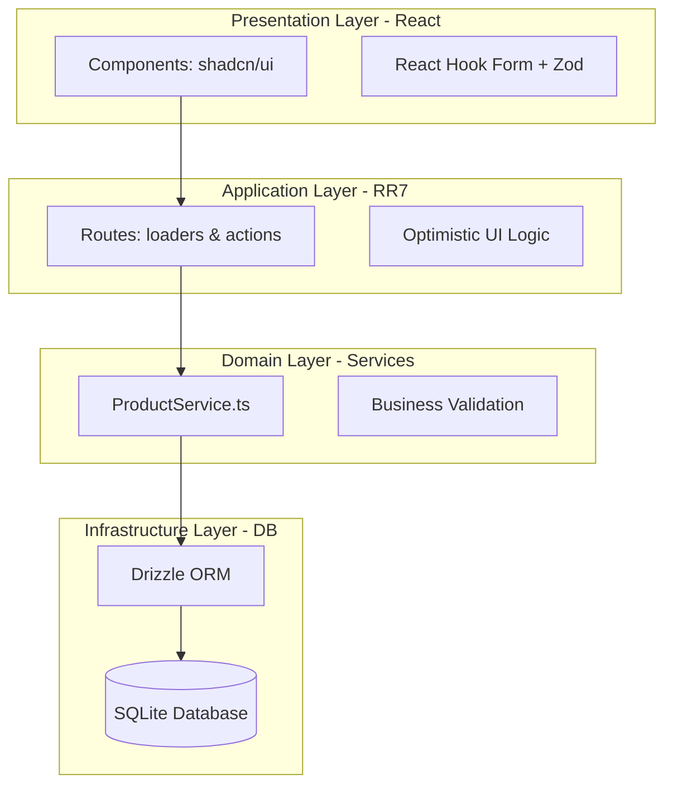

# 🏗️ Architectural Decision Record: Fifty Flowers Product Management System

## 1. Executive Summary
This document outlines the architecture and technical decisions behind the **Fifty Flowers** administration portal. The primary goal was to build a **scalable, maintainable, and high-performance** application, balancing delivery speed with the robustness required for a production-grade environment.

## 2. Tech Stack Rationale
Our technology selection focuses on modern industry standards that maximize **Type-Safety** and Developer Experience (**DX**):

*   **React Router 7 (Framework Mode):** Selected for its unified data model (`loaders/actions`), which eliminates the need for global state management libraries like Redux and simplifies the implementation of **Optimistic UI**.
*   **Drizzle ORM + SQLite (`better-sqlite3`):** Provides a zero-latency persistence layer ideal for internal tools, featuring a robust migration system and end-to-end type safety for the database schema.
*   **Tailwind CSS v4 + shadcn/ui:** Leveraged to ensure a consistent, professional, and accessible interface, adhering to an "Admin-Premium" aesthetic.
*   **Docker & Docker Compose:** Utilized to ensure a reproducible execution environment and facilitate seamless deployment across any infrastructure.

## 3. The Architecture: Layered Service Pattern
We implemented a **Layered Service Architecture** for this project. This structure ensures clear separation of concerns without introducing the friction of heavier architectural patterns.

### Architecture Diagram (Simplified C4)

### Layer Breakdown:
1.  **Infrastructure Layer (`/app/db`):** Contains the "source of truth" (schemas) and database client configuration.
2.  **Service Layer (`/app/services`):** Encapsulates pure business logic. `ProductService` handles all data operations, keeping routes strictly as orchestrators.
3.  **Application Layer (`/app/routes`):** Acts as the controller. Manages data serialization, cookies, URL parameters, and error handling.
4.  **Presentation Layer (`/app/components`):** Pure, decoupled components that react to the state provided by the framework.

---

## 4. Senior Perspective: Why NOT DDD or Hexagonal?
As a Senior Software Engineer, one of the most critical decisions is avoiding **Over-Engineering**.

### Trade-offs and Rationale:
*   **Pragmatism vs. Complexity:** DDD and Hexagonal Architecture excel in domains with massive business complexity and multiple teams. For a Product Catalog CRUD, these patterns would introduce abstraction layers (Ports, Adapters, Domain Entities) that increase verbosity by over **400%** without providing immediate tangible value.
*   **Evolution Velocity:** The chosen architecture allows for database swaps (e.g., migrating from SQLite to PostgreSQL) by modifying only the Infrastructure layer, fulfilling the **Dependency Inversion** principle without the boilerplate overhead of Hexagonal.
*   **Maintainable Simplicity:** We applied the **KISS (Keep It Simple, Stupid)** principle. A new developer can understand the entire data flow in minutes, not hours.

---

## 5. Key Technical Implementations

### A. UX & Data Integrity
*   **Soft Delete + Undo:** We implemented a `deleted_at` column. Upon "deletion," we use **Optimistic UI** to hide the item instantly, while `sonner` provides a 5-second "regret window." This significantly improves perceived speed and user satisfaction.
*   **Async Name Validation:** The Zod schema is refined on the server to check for name uniqueness against the database in real-time before processing form submissions.

### B. Persistent Drag-and-Drop
*   We used `@dnd-kit/sortable` for image reordering. The sequence is persisted via a `display_order` column, ensuring the user's visual intent is preserved across sessions.

### C. Performance Optimizations
*   **React.cache:** Implemented in the service layer to deduplicate database queries during a single request-response cycle (SSR).
*   **Debounced Search:** Product search includes a 300ms delay, preventing unnecessary server load while providing a fluid search experience.

---

## 6. Infrastructure & Deployment
The application is production-ready via a **multi-stage Dockerfile** that minimizes the final image footprint. `docker-compose` manages named volumes for secure and persistent data storage across container restarts.
